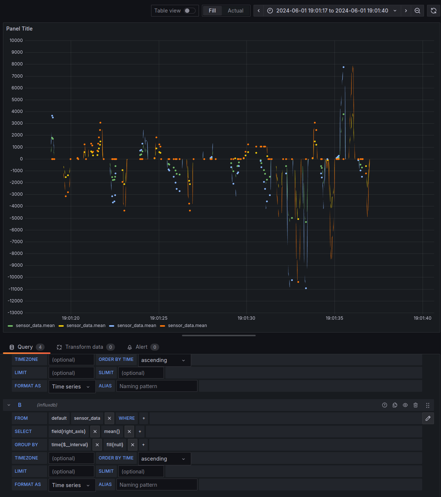

# Magic Carpet

## Installation

Clone this repo, cd magic-carpet

Install Grafana:

```bash
# Add the Grafana APT repository
echo "deb https://packages.grafana.com/oss/deb stable main" | sudo tee -a /etc/apt/sources.list.d/grafana.list

# Add the Grafana GPG key
sudo apt-get install -y software-properties-common
wget -q -O - https://packages.grafana.com/gpg.key | sudo apt-key add -

# Update and install Grafana
sudo apt-get update
sudo apt-get install grafana

sudo systemctl start grafana-server
sudo systemctl enable grafana-server
```

Verify you can see the Grafana web page at `http://192.168.1.18:3000`.

Install InfluxDB for storing time series data:

```bash
wget -qO- https://repos.influxdata.com/influxdb.key | sudo apt-key add -
source /etc/os-release
echo "deb https://repos.influxdata.com/debian $(lsb_release -cs) stable" | sudo tee /etc/apt/sources.list.d/influxdb.list
sudo apt-get update && sudo apt-get install influxdb influxdb-client
sudo systemctl unmask influxdb.service
sudo systemctl start influxdb
sudo systemctl enable influxdb

sudo apt-get install libcurl4-openssl-dev cmake g++
```

Create a database in influx with `influx`, then `CREATE DATABASE mydb` and `exit`

Install the [influxdb-cxx client library](https://www.influxdata.com/blog/getting-started-c-influxdb/):

```bash
sudo apt-get install openssl libssl-dev
git clone git@github.com:libcpr/cpr.git
git clone https://github.com/offa/influxdb-cxx
```

Compile the code:

```bash
sudo apt-get install libboost-all-dev libgtest-dev cmake
git clone https://github.com/Achllle/libroboclaw.git
git clone https://github.com/drewnoakes/joystick.git
cp magic-carpet/joystick_cml.txt joystick/CMakeLists.txt
mkdir build && cd build
cmake ..
cmake --build .
```

if you get
```
error while loading shared libraries: libcpr.so.1: cannot open shared object file: No such file or directory
```

then run `export LD_LIBRARY_PATH=/usr/local/lib` followed by `sudo ldconfig` to refresh dynamic libraries.

### Systemd setup

```
sudo service magiccarpet stop
sudo cp ./magiccarpet.service /etc/systemd/system
sudo cp ./build/bin/carpetfly /usr/bin
sudo systemctl enable magiccarpet.service
sudo service magiccarpet start
```

## Run

```
./bin/carpetfly
```
will attempt to connect to the joystick at `/dev/input/js0` and roboclaw at
`/dev/serial0` with baud rate 115200 and address 128.

Move the joystick axes to send duty commands to the motors.

## Calibrating gamepad

```
jscal /dev/input/js0 -p  # to see current corrections
jscal /dev/input/js0 -c  # follow calibration steps
jscal /dev/input/js0 -p  # to see new suggested corrections, will print a command to execute to store values
jscal -s ......
# not persisted across reboots, so store using jscal-store
sudo jscal-store /dev/input/js0  # stored in /var/lib/joystick/joystick.state
```

## viewing grafana dashboard

From any browser on the same LAN, connect to the RPi's IP:3000 to see the Grafana dashboard connected to InfluxDB


